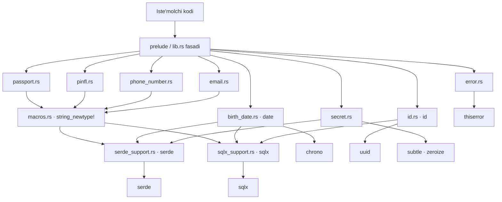
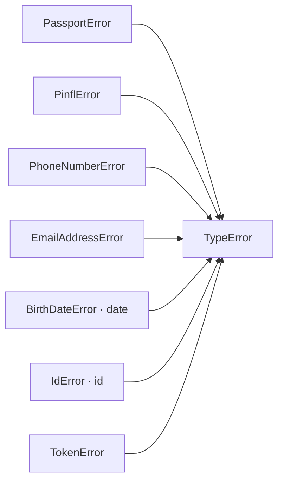
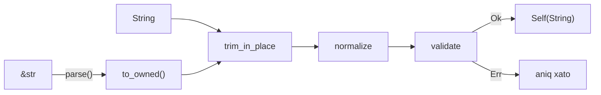
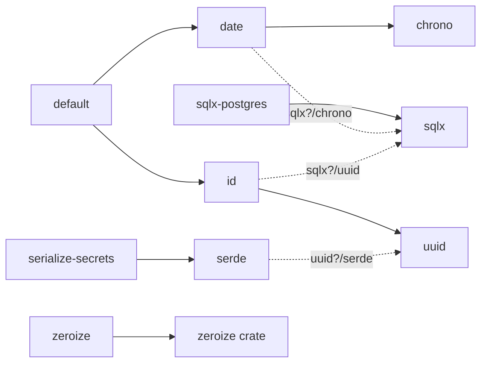

# Arxitektura

`uz-types` **qanday qurilgan** — modul xaritasi, public API indeksi, feature bog'lanishlari
va ma'lumot oqimlari. Maqsad: bu faylni bir marta o'qigan odam (yoki agent) repodagi
har bir qismning o'rnini bilishi va `rg` bilan qaytadan "kashf" qilmasligi.

**Bu yerda yo'q:**

| Savol | Qayerda |
| --- | --- |
| Tiplarni qanday **ishlatish** kerak? | [`README.md`](../README.md) |
| **Nega** shunday qilingan, qachon o'zgargan? | [`CHANGELOG.md`](../CHANGELOG.md) |
| Kod yozishning **idiomatik qoidalari**? | `.claude/skills/idiomatic-rust/SKILL.md` / `.codex/skills/idiomatic-rust/SKILL.md`|
| Kundalik **buyruqlar** va qaytarilmaydigan qarorlar? | [`CLAUDE.md`](../CLAUDE.md) / [`AGENTS.md`](../AGENTS.md) |

---

## 1. Repo xaritasi

Crate `v0.21.0`, edition 2024, MSRV 1.85. `src/` — 13 fayl, ~2 200 qator.

| Fayl | Mas'uliyat | Public tiplar | Feature |
| --- | --- | --- | --- |
| `src/lib.rs` | crate atributlari, modul grafi, `pub use` fasadi | — | — |
| `src/prelude.rs` | fasadning to'liq oynasi (bitta `use` uchun) | — | — |
| `src/macros.rs` | `string_newtype!`, `trim_in_place` | `pub(crate)` | — |
| `src/passport.rs` | 2 harf + 7 raqam (`AA1234567`) | `Passport`, `PassportError` | — |
| `src/pinfl.rs` | 14 raqamli JShShIR, checksum, jins/asr/sana | `Pinfl`, `Gender`, `PinflError` | — |
| `src/phone_number.rs` | `998` + operator kodi + 7 raqam | `PhoneNumber`, `PhoneNumberError` | — |
| `src/email.rs` | ASCII email, lowercase normalizatsiya | `EmailAddress`, `EmailAddressError` | — |
| `src/birth_date.rs` | `NaiveDate` ustida value object | `BirthDate`, `DateFormat`, `BirthDateError` | `date` |
| `src/id.rs` | `Id<Tag>`, `NumId<Tag, R>`, sealed `NumIdRepr` | `Id`, `NumId`, `NumIdRepr`, `IdError` | `id` |
| `src/secret.rs` | `secret_newtype!` + 3 token tipi | `AccessToken`, `RefreshToken`, `ClientSecret`, `TokenError`, `MAX_TOKEN_LEN` | — |
| `src/error.rs` | `TypeError` aggregate | `TypeError` | — |
| `src/serde_support.rs` | barcha string tiplar uchun yagona `Visitor` | `pub(crate)` | `serde` |
| `src/sqlx_support.rs` | `sqlx_via!` makrosi | `pub(crate)` | `sqlx` |

Qo'shimcha: `tests/` (3 fayl), `benches/parse.rs`, `examples/types_example.rs`.

### Public sirt qayerdan chiqadi

**`prelude` dan boshqa hamma modul `private`** (`src/lib.rs:24-43`). Ya'ni
`uz_types::passport::Passport` — mavjud bo'lmagan yo'l; yagona yo'l `uz_types::Passport`.
Public sirt to'liq `src/lib.rs:45-58` dagi `pub use` ro'yxatidan iborat, `src/prelude.rs`
esa o'sha ro'yxatning aynan nusxasi.

Buning natijasi: **modul ichini qayta tashkil qilish breaking emas** — faqat `lib.rs`
dagi `pub use` qatorlari semver yuzasini belgilaydi.

### Crate atributlari (`src/lib.rs:1-12`)

| Atribut | Ta'sir |
| --- | --- |
| `#![warn(missing_docs)]` | har bir public element hujjatlangan bo'lishi shart |
| `#![deny(unsafe_code)]` | `unsafe` yo'q |
| `#![cfg_attr(docsrs, feature(doc_cfg))]` | docs.rs da feature belgilari ko'rinadi |
| `#![cfg_attr(all(feature = "date", feature = "id"), doc = include_str!("../README.md"))]` | README = crate doc = doctest |
Oxirgisi muhim: **README dagi har bir ```rust bloki ishlaydigan doctest**. U faqat `date`
**va** `id` yoqilganda qo'shiladi, chunki README kod bloklari `BirthDate`, `NumId`, `IdError`
ishlatadi. README ni tahrirlagach `cargo test --all-features --doc`.

---

## 2. Qatlamlar



Uch qatlam bor:

1. **Domen qatlami** — har bir tip o'z faylida, faqat `normalize` + `validate` + query metodlar.
2. **Makro qatlami** — `macros.rs` (ochiq tiplar) va `secret.rs` (sir tiplari) boilerplate'ni beradi.
3. **Integratsiya qatlami** — `serde_support.rs` va `sqlx_support.rs`; ular domen tiplarini
   *bilmaydi*, faqat generic bound'lar orqali ishlaydi.

---

## 3. Public API indeksi

### 3.1. String value objectlar

`Passport`, `Pinfl`, `PhoneNumber`, `EmailAddress` — to'rttasi ham `string_newtype!` dan chiqadi,
shuning uchun **umumiy sirti bir xil** (`src/macros.rs:28-131`):

| Element | Izoh |
| --- | --- |
| `derive` | `Debug`, `Clone`, `PartialEq`, `Eq`, `Hash`, `PartialOrd`, `Ord` |
| `parse(&str) -> Result<Self, E>` | `to_owned()` + `TryFrom<String>` |
| `as_str(&self) -> &str` | `#[inline] #[must_use]` |
| `into_inner(self) -> String` | validatsiyadan chiqish |
| `TryFrom<String>` | **yagona haqiqiy konstruktor** |
| `TryFrom<&str>`, `FromStr` | `parse` ga tushadi |
| `From<Self> for String`, `Display`, `AsRef<str>`, `Borrow<str>` | `Borrow` → `HashMap::get("...")` ishlaydi |
| `Serialize` / `Deserialize` | `serde` feature |
| `Type`/`Encode`/`Decode`/`PgHasArrayType` | `sqlx` feature, `sqlx_via!` orqali |

Tipga xos qism:

| Tip | Normalizatsiya | `parse()` tekshiradi | Query metodlar | Konstantalar |
| --- | --- | --- | --- | --- |
| `Passport` | ichki bo'shliqlar olib tashlanadi, UPPERCASE | uzunlik 9, ASCII, 2 harf + 7 raqam | `series()`, `number()` | `SERIES_LEN=2`, `NUMBER_LEN=7`, `LEN=9` |
| `Pinfl` | yo'q (no-op) | uzunlik 14, hammasi raqam | `parse_strict()`, `is_checksum_valid()`, `gender()`, `century()`, `birth_date_parts()`, `region_code()`, `serial()`, `birth_date()`/`birth_date_at()` (`date`) | `LEN=14` |
| `PhoneNumber` | boshidagi `+`, bo'shliq, `-`, `(`, `)`, `.` olib tashlanadi | hammasi raqam, uzunlik 12, `998` prefiksi | `parse_strict()`, `operator_code()`, `subscriber_number()`, `is_mobile()`, `is_known_operator()`, `to_international()` | `DIGIT_LEN=12`, `COUNTRY_CODE="998"`, `OPERATOR_CODE_LEN=2`, `MOBILE_CODES: &[&str]`, `REGIONAL_CODES: RangeInclusive<u8> = 60..=79` |
| `EmailAddress` | lowercase | ≤254, ASCII, bo'shliqsiz, bitta `@`, local-part va domain alohida | `local_part()`, `domain()` | `MAX_LEN=254`, `LOCAL_PART_MAX_LEN=64`, `DOMAIN_MAX_LEN=253`, `DOMAIN_LABEL_MAX_LEN=63`, `TLD_MIN_LEN=2` |

`MOBILE_CODES` **slice**, `REGIONAL_CODES` **`RangeInclusive`** — ataylab: yangi operator kodi
qo'shish breaking o'zgarish bo'lmasligi uchun (massiv bo'lganda uzunlik tipga kirardi).

`Pinfl` raqamlarining ma'nosi: 1 — jins+asr, 2–7 — `DDMMYY`, 8–10 — hudud, 11–13 — tartib,
14 — nazorat raqami (`[7,3,1]` vaznlar, mod 10; VM qarori №177, 12.04.2022).

### 3.2. `BirthDate` va `DateFormat` (feature `date`)

`BirthDate(NaiveDate)` — `Copy`, `Ord`.

| Metod | Izoh |
| --- | --- |
| `parse(&str)` | `YYYY-MM-DD` |
| `parse_with_format(&str, DateFormat)` | boshqa format |
| `from_naive_date(NaiveDate)` | `chrono` dan |
| `*_at(…, today: NaiveDate)` | **deterministik** variantlar — soatga tegmaydi |
| `as_naive_date()`, `format_as(DateFormat)` | chiqish |
| `year()`, `month()`, `day()` | qismlar |
| `age()`, `age_at(today)` | yosh |

Konstruksiyada ikki tekshiruv: `year < MIN_YEAR` (1800) → `TooOld`; `date > today + 1` →
`FutureDate` (bir kunlik yon berish — UTC+14 uchun).

Ikki nozik qaror:

- **Kelajak tekshiruvi monoton** — bir marta qabul qilingan sana keyin hech qachon rad etilmaydi,
  shuning uchun `Deserialize` va replay xavfsiz.
- **`MIN_YEAR = 1800` — sanity floor, biznes qoidasi emas.** `Pinfl::century()` 1-raqam `1`/`2`
  bo'lganda 1800 qaytaradi; chegara 1900 bo'lganda `Pinfl::birth_date()` bunday PINFL uchun
  har doim `None` berardi. Yosh chegaralari (`>= 18`) ilova qatlamida `age_at` bilan qo'yiladi.

`DateFormat` — 4 variant (`YmdHyphen`, `DmyHyphen`, `YmdDot`, `DmyDot`), `pattern()` va
`reversed()` `const fn`.

### 3.3. `Id<Tag>` va `NumId<Tag, R>` (feature `id`)

**Crate ID nomlarini bermaydi.** `OrderId`, `SessionId` — iste'molchining domeni; crate faqat
mexanizm beradi. Tayyor alias'lar 0.20.0–0.21.0 da ataylab olib tashlangan (sabab: prelude nom
to'qnashuvi, ko'rinish domen nomiga yopishib qolishi). Bu qaror qaytarilmaydi.

```rust,ignore
pub mod tag { pub enum Order {} pub enum LegacyInvoice {} }

pub type OrderId = uz_types::Id<tag::Order>;                          // UUID
pub type LegacyInvoiceId = uz_types::NumId<tag::LegacyInvoice, i64>;  // BIGINT
```

| Tip | Asosiy metodlar |
| --- | --- |
| `Id<Tag>` | `new_v4()`, `now_v7()`, `from_uuid()`, `parse()`, `as_uuid()`, `into_uuid()`, `version()`, `is_nil()` |
| `NumId<Tag, R>` | `new()`, `parse()`, `get()`, `to_bigint()`, `is_db_safe()` |
| `NumId<Tag, u64>` (faqat) | `MAX_DB_SAFE`, `try_new_db_safe()`, `parse_db_safe()` |

Ikki struktur qaror:

- **`PhantomData<fn() -> Tag>`**, `PhantomData<Tag>` emas — shunda `Id<Tag>` har doim
  `Send + Sync + Unpin` va `Tag` bo'yicha kovariant bo'ladi, hatto `Tag = Cell<u8>` bo'lsa ham.
- **Trait'lar qo'lda impl qilingan**, derive emas (`src/id.rs:121`): `#[derive(Clone)]`
  `Tag: Clone` bound'ini talab qilardi, holbuki `Tag` hech qachon instansiyalanmaydi.

#### `NumIdRepr` — sealed trait

`src/id.rs:233-268`. `mod sealed` orqali yopilgan: faqat `u64` (default) va `i64`.
A'zolari: `DEBUG_SUFFIX`, `to_bigint()`, `from_bigint()`, `parse_repr()`, va `serde` ostida
`serialize_repr`/`deserialize_repr`.

| | `NumId<Tag>` (`u64`) | `NumId<Tag, i64>` |
| --- | --- | --- |
| Diapazon | `0..=u64::MAX` | `i64::MIN..=i64::MAX` |
| `Encode` (`BIGINT`) | `> i64::MAX` → `IdError::NumberTooLarge` | xato yo'li **yo'q** |
| `Decode` (`BIGINT`) | manfiy → `IdError::NumberNegative` | xato yo'li **yo'q** |
| `parse` | `-` va `+` rad etiladi | `-` qabul, `+` rad |
| Manfiy legacy ID | ❌ | ✅ |
| `try_new_db_safe` / `parse_db_safe` | ✅ | kerak emas |

`u64` da xato **query paytida** yuzaga chiqadi — bu eng yomon vaqt. Shuning uchun
`try_new_db_safe`/`parse_db_safe` xatoni **konstruksiya paytiga** ko'chiradi: chegarani
input tomonida qo'ying, `sqlx` chaqiruvida emas. `i64` da bu muammo umuman yo'q.

#### Bir xil konversiya sirti

0.21.0 dan uchala oila (`Id<Tag>`, `NumId<Tag, R>`, string tiplar) bir xil beradi:
`FromStr` + `TryFrom<&str>` + `TryFrom<String>` + `From<Self> for String`.
Ya'ni `T: TryFrom<String>` bound'i ostidagi generic kod uchalasi bilan ishlaydi — **buzmang**.

### 3.4. Sir tiplari

`AccessToken`, `RefreshToken`, `ClientSecret` — `secret_newtype!` dan (`src/secret.rs:37-131`).
`MAX_TOKEN_LEN = 8192`; validatsiya: bo'sh emas + chegaradan qisqa.

Bu makro `string_newtype!` ga parallel, lekin **ataylab kambag'al**:

| Bor | Ataylab YO'Q |
| --- | --- |
| `parse()`, `expose_secret()` | `Display`, `AsRef<str>`, `Borrow<str>`, `Deref` |
| `Debug` → `AccessToken([REDACTED])` | `into_inner()`, `From<Self> for String` |
| constant-time `PartialEq` (`subtle`) | derive `PartialEq`/`Hash`/`Ord`/`PartialOrd` |
| `Drop` → `zeroize()` (feature `zeroize`) | default `Serialize` (faqat `serialize-secrets`) |
| `Deserialize` (feature `serde`) | **`sqlx` impl'lari umuman yo'q** |
| `TryFrom<String>`/`TryFrom<&str>`/`FromStr` | |

Har bir "yo'q" — sirni tasodifan log'ga, xato xabariga yoki DB'ga chiqarib yuborish yo'lini
yopish. `zeroize` yoqilganda **rad etilgan** bufer ham tozalanadi (`src/secret.rs:70-74`).
Sir tipiga oddiy trait qo'shishdan oldin nega yo'qligini o'ylang.

### 3.5. Xatolar



Har bir `parse()` **o'zining aniq** xatosini qaytaradi; `TypeError` — `?` bilan yig'ish uchun
aggregate (`src/error.rs`), barcha variantlari `#[error(transparent)]` + `#[from]`.

| Xato | Variantlar | Gate |
| --- | --- | --- |
| `PassportError` | `Length`, `Format` | — |
| `PinflError` | `Length`, `Format`, `Checksum`, `Structure` | — |
| `PhoneNumberError` | `Length`, `Format`, `Prefix`, `UnknownOperatorCode` | — |
| `EmailAddressError` | `Length`, `Format` | — |
| `BirthDateError` | `Date`, `FutureDate`, `TooOld` | `date` |
| `IdError` | `Uuid`, `Number`, `NumberTooLarge { value: u64 }`, `NumberNegative { value: i64 }` | `id` |
| `TokenError` | `Empty`, `TooLong` | — |

Hammasi `#[non_exhaustive]`. Leaf xatolar `Copy`, `TypeError` esa `Copy` emas.
Yangi xato tipi qo'shsangiz `TypeError` ga variant qo'shish **shart**.

---

## 4. Ma'lumot oqimlari

### 4.1. Parse oqimi



`TryFrom<String>` — **yagona haqiqiy konstruktor** (`src/macros.rs:55-64`); `parse`,
`TryFrom<&str>`, `FromStr` hammasi unga tushadi. Tartib qat'iy va makro darajasida qulflangan:

1. **`trim_in_place`** (`src/macros.rs:11-18`) — makro bajaradi, tipda takrorlanmaydi.
   Allocation'siz: `truncate(trim_end().len())` + `drain(..start)` (memmove).
2. **`normalize`** — tip yozadi. Imzo uzunlik o'zgarishiga qarab tanlanadi:
   uzunlik o'zgarsa `&mut String` (`Passport`, `PhoneNumber`), faqat case o'zgarsa
   `&mut str` (`EmailAddress`), hech nima o'zgarmasa `&mut str` no-op (`Pinfl`).
   Deref coercion tufayli makro ikkalasini ham qabul qiladi.
3. **`validate`** — tip yozadi, **normalizatsiyadan keyingi** matn ustida ishlaydi.

**Allocation intizomi:** `TryFrom<String>` yo'li hech qachon qo'shimcha allocation qilmaydi.
Bu da'vo `benches/parse.rs` va modul ichidagi `try_from_string_reuses_buffer` uslubidagi
testlar bilan qulflangan — buzmang.

### 4.2. serde deserializatsiya

Barcha string tiplar uchun **bitta** Visitor: `deserialize_string_newtype`
(`src/serde_support.rs:21-57`). Bound'lari: `T: FromStr + TryFrom<String>`.

| Yo'l | Kim chaqiradi | Nima bo'ladi |
| --- | --- | --- |
| `visit_str` | `serde_json::from_str` (borrowed) | `FromStr` → bitta allocation |
| `visit_string` | `serde_json::Value`, `bincode`, `postcard` | `TryFrom<String>` → deserializer buferi **qayta ishlatiladi** |

Hint `deserializer.deserialize_string(...)` — "ownership bera olsang ber". Haqiqiy zero-copy
printsipial mumkin emas: tiplar `String` saqlaydi.

`expecting` matni chaqiruvchidan literal sifatida keladi: `string_newtype!` da `$expecting`
argumenti, `BirthDate` va sirlarda qo'lda yozilgan.

**Eng muhimi:** smart constructor chetlab o'tilmaydi — noto'g'ri JSON `Err` beradi
(`tests/serde.rs` buni qulflaydi).

**Istisnolar:** `Id<Tag>` → `Uuid::deserialize` ga delegatsiya (JSON'da string, binary
formatlarda 16 bayt); `NumId<Tag, R>` → `R::deserialize_repr` (JSON'da **har doim** integer).

### 4.3. sqlx `Encode` / `Decode`

`sqlx_via!` (`src/sqlx_support.rs:13-70`) to'rtta impl beradi: `Type<DB>`, `Encode<'q, DB>`,
`Decode<'r, DB>` va `PgHasArrayType`. Uchtasi driver-agnostik (`DB: Database` — postgres,
mysql, sqlite); `PgHasArrayType` faqat `sqlx-postgres` ostida (`= ANY($1)` uchun kerak).

```
DB qiymati → $Inner decode → ($decode)(inner)? → Self
```

`Decode` **har doim validatsiyadan o'tadi** — bu `#[sqlx(transparent)]` derive'dan asosiy farq.
DB'dagi buzuq yozuv `try_get` da xato beradi, jim o'tmaydi.

| Tip | `$Inner` | Qayerda |
| --- | --- | --- |
| `Passport`, `Pinfl`, `PhoneNumber`, `EmailAddress` | `String` | `src/macros.rs:130-131` (avtomatik) |
| `Id<Tag>` | `Uuid` | `src/id.rs:221-227` (qo'lda chaqirilgan) |
| `BirthDate` | `NaiveDate` | `src/birth_date.rs:218-224` (qo'lda chaqirilgan) |
| `NumId<Tag, R>` | `i64` | `src/id.rs:536-581` — **makro emas, qo'lda impl** |
| sir tiplari | — | **yo'q, ataylab** |

`NumId` nega qo'lda: ikkala repr ham `BIGINT` ga tushadi, lekin `u64` da `to_bigint`/`from_bigint`
xato yo'llari bor (`NumberTooLarge`, `NumberNegative`). `sqlx_via!` bu `R` ga bog'liq
konversiyani ifodalay olmaydi.

Jonli DB testi yo'q; `tests/sqlx_bounds.rs` trait'lar borligini **compile-time** da qulflaydi.

---

## 5. Ikki qatlamli validatsiya — asosiy dizayn qarori

| Qatlam | Nima | Qayerda |
| --- | --- | --- |
| **Struktura** — hech qachon o'zgarmaydi | uzunlik, belgilar, prefiks, kalendar sanasi | `parse()` |
| **Registry / biznes** — vaqt bilan o'zgaradi | operator kodi ro'yxatda bormi, PINFL checksum | `is_*()`, `parse_strict()` |

Tiplar bo'yicha aniq taqsimot:

| Tip | `parse()` da | `parse_strict()` da qo'shiladi |
| --- | --- | --- |
| `Passport` | uzunlik, ASCII, harf/raqam shakli | — (`parse_strict` yo'q: hammasi struktura) |
| `Pinfl` | 14 raqam | checksum + jins/asr belgisi + sana qismlari (`PinflError::Checksum` / `Structure`) |
| `PhoneNumber` | 12 raqam, `998` prefiksi | operator/hudud kodi ro'yxatda (`UnknownOperatorCode`) |
| `EmailAddress` | uzunliklar, ASCII, `@`, local/domain | — (MX yozuvi tekshirilmaydi) |
| `BirthDate` | kalendar sanasi, `MIN_YEAR`, kelajak emas | — (yosh chegarasi ilova qatlamida `age_at`) |

**Qoida:** o'zgaruvchan faktni (`MOBILE_CODES`, checksum, jins/asr) hech qachon `parse()`
ichiga ko'chirmang — DB va Kafka'dagi eski yozuvlar o'qilmay qoladi.

Amaliy tanlov:

- **DB'dan / event'dan o'qish** → `parse()`
- **Foydalanuvchi kiritgan ma'lumot** → `parse_strict()`

---

## 6. Feature'lar



| Feature | Default | Nimani yoqadi | Dependency | Fayl |
| --- | --- | --- | --- | --- |
| `date` | ✅ | `BirthDate`, `DateFormat`, `Pinfl::birth_date()` | `chrono` | `src/birth_date.rs` |
| `id` | ✅ | `Id`, `NumId`, `NumIdRepr`, `IdError` | `uuid` | `src/id.rs` |
| `serde` | — | `Serialize`/`Deserialize` (sirlarda faqat `Deserialize`) | `serde` | `src/serde_support.rs` |
| `sqlx` | — | `Type`/`Encode`/`Decode` | `sqlx` | `src/sqlx_support.rs` |
| `sqlx-postgres` | — | `PgHasArrayType` (`= ANY($1)`) | `sqlx/postgres` | `src/sqlx_support.rs:60-68` |
| `zeroize` | — | sir tiplarida `Drop` | `zeroize` | `src/secret.rs:109-114` |
| `serialize-secrets` | — | sir tiplari uchun `Serialize` | (`serde` ni yoqadi) | `src/secret.rs:123-129` |

Feature nomlari **1.0 gacha qulflangan**.

Ikki nozik nuqta:

- `date`/`id` o'z dependency'lariga `sqlx` optional feature'ini uzatadi (`sqlx?/chrono`,
  `sqlx?/uuid`) — ya'ni `sqlx` yoqilmasa hech nima qo'shilmaydi.
- Sirlar `Deserialize` ni `serde` bilan oladi, lekin `Serialize` ni **faqat**
  `serialize-secrets` bilan. Ya'ni sirni tasodifan JSON'ga chiqarib bo'lmaydi.

### MSRV — ikkita pol

`rust-version = "1.85"` (edition 2024) — iste'molchi uchun. `sqlx` feature'i **1.94+** talab
qiladi (sqlx 0.9), lekin cargo per-feature MSRV'ni bilmaydi, shuning uchun manifestda eng past
umumiy qiymat turadi va CI ikkala polni **alohida job**'da tekshiradi.

MSRV tekshiruvi `--all-targets` **ishlatmaydi**: u dev-dep'larni tortadi (criterion → 1.86),
downstream esa ularni yuklamaydi.

---

## 7. Kengaytirish retseptlari

### Yangi string tip qo'shish

Makroni chaqirasiz + **ikkita** funksiya yozasiz:

```rust,ignore
string_newtype! {
    /// Doc-comment majburiy (`#![warn(missing_docs)]`).
    pub struct Inn;
    error = InnError;              // o'zining aniq xatosi
    expecting = "a 9-digit INN";   // serde xato xabari
}

impl Inn {
    fn normalize(s: &mut String) { /* yoki &mut str, agar uzunlik o'zgarmasa */ }
    fn validate(s: &str) -> Result<(), InnError> { /* normalizatsiyadan KEYIN */ }
}
```

Keyin tekshiriladigan fayllar ro'yxati:

| # | Fayl | Nima qo'shiladi |
| --- | --- | --- |
| 1 | `src/inn.rs` | makro chaqiruvi + `normalize` + `validate` + xato enum'i (`#[non_exhaustive]`) |
| 2 | `src/lib.rs` | `mod inn;` + `pub use` (+ feature gate va `doc(cfg)` kerak bo'lsa) |
| 3 | `src/prelude.rs` | `pub use` |
| 4 | `src/error.rs` | `TypeError` varianti `#[from]` bilan |
| 5 | `tests/props.rs` | `never_panics_and_roundtrips!` ro'yxatiga |
| 6 | `tests/serde.rs` | roundtrip + invalid rad etilishi |
| 7 | `tests/sqlx_bounds.rs` | `assert_pg_type::<Inn>()` |
| 8 | `README.md` | § Tiplar bo'limiga (kod bloki = doctest) |
| 9 | `CHANGELOG.md` | Unreleased → Qo'shildi |

Trim'ni takrorlamang — makro bajaradi. Allocation qo'shmang — `TryFrom<String>` yo'li toza qolsin.

### Yangi feature qo'shish

`Cargo.toml` `[features]` → `src/lib.rs` modul-doc ro'yxati (`:16-22`) →
`#[cfg_attr(docsrs, doc(cfg(feature = "…")))]` re-export'da → `justfile` dagi `msrv` qatorlariga →
`.github/workflows/ci.yml` dagi mos job.

`just features` (cargo-hack powerset) yangi feature'ni **avtomatik** oladi — qo'lda ro'yxat yo'q.

### Yangi xato qo'shish

Leaf enum: `#[derive(Debug, Clone, Copy, PartialEq, Eq, thiserror::Error)]` +
`#[non_exhaustive]` → `src/error.rs` da `TypeError` varianti `#[error(transparent)]` + `#[from]`.

---

## 8. Invariantlar va ular qayerda qulflangan

Biror narsa buzilsa qaysi test qizil bo'ladi:

| Invariant | Qulf |
| --- | --- |
| Hech qanday input panic qilmaydi (`\PC{0,64}`) | `tests/props.rs` |
| `parse` idempotent — normalizatsiya barqaror | `tests/props.rs` |
| `&str` va `String` yo'llari bir xil natija beradi | `tests/props.rs` |
| Pinfl checksum rasmiy `[7,3,1] mod 10` bilan mos | `tests/props.rs` |
| `is_db_safe` ↔ `try_new_db_safe` ↔ `to_bigint` mos | `tests/props.rs` |
| `TryFrom<String>` qo'shimcha allocation qilmaydi | `benches/parse.rs` + modul-ichi unit testlar |
| Smart constructor serde orqali chetlab o'tilmaydi | `tests/serde.rs` |
| JSON shakli bitta: `Id` → string, `NumId` → integer | `tests/serde.rs` |
| Sirlar default'da `Serialize` qilinmaydi | `tests/serde.rs` |
| sqlx trait bound'lari mavjud (`Vec<T>` ham) | `tests/sqlx_bounds.rs` (DB kerak emas) |
| `Id<Tag>` `Send + Sync`, hatto `Tag = Cell<u8>` da | `src/id.rs` unit testi |
| README kod bloklari ishlaydi | `cargo test --all-features --doc` |
| Public sirt semver'ga mos | `just semver` (`cargo-semver-checks`) |

Unit testlar modul ichida (`#[cfg(test)] mod tests`), integration `tests/` da.
`--all-features` deyarli har doim kerak: `tests/serde.rs` va `tests/sqlx_bounds.rs` to'liq
`#![cfg(feature = …)]` ostida.

---

## 9. Sifat kontuuri — `justfile` ↔ CI

`just ci` — CI job'larining aynan o'zi. Ikkalasi ham `RUSTFLAGS=-D warnings` bilan ishlaydi.

| CI job (`.github/workflows/ci.yml`) | justfile target | Nima qiladi |
| --- | --- | --- |
| `check` | `fmt-check`, `lint`, `test`, `example` | fmt + clippy + test + example |
| `docs` | `doc-check` | `RUSTDOCFLAGS=-D warnings cargo doc` — buzuq havolalarni tutadi |
| `msrv` | `msrv` (1-2 qatori) | 1.85, `sqlx` siz, `--all-targets` **emas** |
| `msrv-sqlx` | `msrv` (3-qatori) | 1.94, `--all-targets --all-features` |
| `features` | `features` | powerset (~90 komb.) + each-feature (~10 komb.) |
| `audit` | `audit` | `cargo audit` (CVE) + `cargo machete` (ishlatilmagan dep) |
| `semver` | `semver` | `cargo-semver-checks`, `RUSTFLAGS=""` bilan |
| `package` | `package` | `include` ro'yxati va `Cargo.lock` sinxroni |

Faqat lokal (CI'da yo'q): `fmt`, `bench`, `doc`, `tree`, `publish-check`, `publish`,
`ai-check`, `ai-setup`.

Kundalik ikkita buyruq:

```bash
just check   # ~3s, tarmoqsiz — commit'dan oldin
just ci      # ~80s — push'dan oldin
```

Reliz: `just semver-detail` (aynan nima breaking) → CHANGELOG (migratsiya jadvali bilan) →
`just publish-check` → `just publish`.

---

## 10. Hujjatlar xaritasi

| Savol | Manba |
| --- | --- |
| Qanday ishlatish? Namunalar? | `README.md`, `examples/types_example.rs` |
| Qanday qurilgan? Qaysi fayl nima qiladi? | **shu fayl** |
| Kundalik buyruqlar, qaytarilmaydigan qarorlar | `CLAUDE.md` / `AGENTS.md` |
| Idiomatik Rust qoidalari (kod yozishdan oldin) | `.claude/skills/idiomatic-rust/SKILL.md` |
| Nega shunday? Qachon o'zgargan? | `CHANGELOG.md` |
| Aniq nuqtaviy savol (`X` qayerda ishlatiladi?) | `graphify query "<savol>"` |
| Modul strukturasi daraxti | `just tree` (`cargo-modules`) |
| To'liq API imzolari | `just doc` yoki [docs.rs/uz-types](https://docs.rs/uz-types) |

Kod o'zgargandan keyin grafni yangilash: `graphify update .` (AST-only, API xarajati yo'q).
