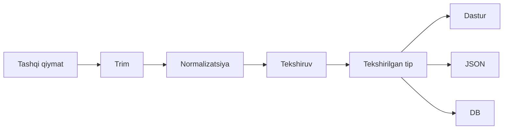
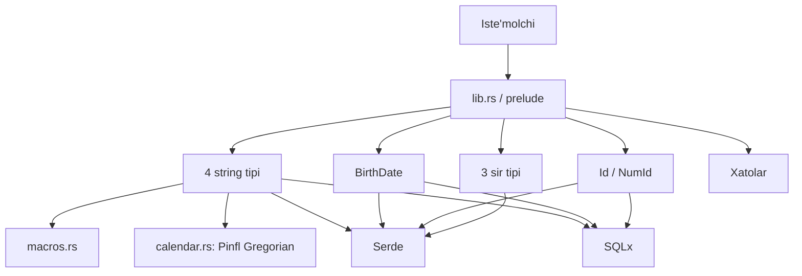

# Arxitektura

`uz-types` O'zbekiston domenidagi qiymatlarni oddiy matn yoki son sifatida emas, tekshirilgan
maxsus tip sifatida saqlashga yordam beradi. Masalan, oddiy `String` istalgan matnni qabul
qiladi; `Passport` esa faqat normalizatsiya va tekshiruvdan o'tgan pasport raqamini ifodalaydi.
Shu sabab noto'g'ri qiymat dastur ichiga kirgan joyning o'zida aniq xato qaytaradi.

Bu qo'llanma ikki darajali: bo'limlarning boshidagi oddiy izohlar g'oyani tushuntiradi,
keyingi texnik qismlar esa kutubxonani saqlab rivojlantiradigan maintainer (saqlovchi)
uchun aniq shartlarni beradi.

**Uchta o'qish yo'li:**

1. Dasturchi bo'lmagan o'quvchi: §1–3 — kutubxona nima qiladi va qismlar qanday bo'lingan.
2. Kutubxona foydalanuvchisi: §1–6 — qiymat oqimi, tip oilalari va ixtiyoriy imkoniyatlar.
3. Maintainer: §7–10 — kengaytirish, test qamrovi, reliz va fayl darajasidagi texnik ma'lumot.

**Boshlang'ich lug'at:**

| Atama | Shu hujjatdagi ma'nosi |
| --- | --- |
| Value object | O'z qiymati va invariantlari bilan aniqlanadigan maxsus tip |
| Invariant | Kutubxona buzmasligi kerak bo'lgan va'da |
| Normalizatsiya | Bir qiymatning turli yozilishlarini bitta ichki ko'rinishga keltirish |
| Smart constructor | Tipni faqat tekshiruvdan keyin yaratadigan konstruktor |
| Feature | Kerak bo'lganda Cargo orqali yoqiladigan ixtiyoriy imkoniyat |
| Crate | Cargo orqali tarqatiladigan Rust kutubxonasi; bu yerda `uz-types` |
| Public API | Tashqi loyiha ishlata oladigan tip, metod, konstanta va traitlar sirti |
| Fasad | Ichki modullarni yashirib, tashqariga qulay public nomlar beradigan kirish sirti |
| Boilerplate | Ko'p tipda bir xil takrorlanadigan texnik kod |
| Trait | Tip qanday operatsiyalarni qo'llashini bildiradigan Rust shartnomasi |
| Owned qiymat | Xotirasi vaqtincha qarzga olinmagan, egasi aniq qiymat |
| Allocation | Dastur boshqaradigan dinamik xotiradan yangi joy ajratish |
| Downstream | `uz-types`ga bog'liq kutubxona sifatida ulanadigan tashqi loyiha |
| Replay | Oldin saqlangan DB yozuvi yoki eventni keyinroq qayta o'qish |
| Registry tekshiruvi | Vaqt o'tishi bilan o'zgarishi mumkin bo'lgan kodlar ro'yxatiga qarash |
| Checksum | Raqamlar buzilmaganini formula bilan tekshiradigan nazorat raqami |
| Visitor | Serde deserializatoridan qiymatni qabul qiladigan yordamchi protokol tipi |
| Zero-copy | Kirish buferini nusxalamasdan ishlatish; buferni qayta ishlatish bilan aynan bir narsa emas |
| Constant-time | Teng uzunlikdagi sir qiymatlariga bog'liq vaqt farqini kamaytiruvchi taqqoslash |
| Best-effort | Imkon qadar bajariladigan, ammo barcha tashqi nusxalar uchun mutlaq kafolat bermaydigan himoya |
| Aggregate xato | Bir nechta aniq xato tipini bitta umumiy enumda birlashtiradigan xato |
| Leaf xato | Bitta domen parseriga xos aniq xato tipi |
| Sealed trait | Faqat shu crate ichida implementatsiya qilish mumkin bo'lgan trait |
| Generic bound | `T: FromStr` kabi, umumiy tipdan qaysi traitlar talab qilinishini bildiradigan shart |
| Marker yoki tag | Dastur ishlayotganda qiymati yo'q, tiplarni kompilyatsiya vaqtida ajratadigan belgi |
| Alias | Mavjud tipga iste'molchi qo'yadigan boshqa nom |
| SemVer | Public API mosligiga qarab versiya chegarasini tanlash qoidasi |
| Crate root | `uz_types::...` nomlari boshlanadigan asosiy public kirish nuqtasi |
| Prelude | Ko'p ishlatiladigan nomlarni bitta `use` bilan import qilish moduli |
| Re-export | Ichki moduldagi public nomni crate root yoki prelude orqali qayta ochish |

## 1. Besh daqiqada arxitektura

Oddiy ko'rinishda kutubxona tashqi qiymatni tozalaydi, tekshiradi va shundan keyingina
dastur, JSON yoki ma'lumotlar bazasi ishlata oladigan tipga aylantiradi:



Bu chizmadagi to'liq `trim → normalizatsiya → tekshiruv` zanjiri aynan
`Passport`, `Pinfl`, `PhoneNumber` va `EmailAddress` oilasiga tegishli. Sirlar,
UUID ID, raqamli ID va `BirthDate` o'zlariga mos qisqaroq konstruktor oqimiga ega;
ular §4 da alohida ko'rsatilgan.

`parse()` doim mavjud tipning asosiy strukturaviy talablarini tekshiradi.
Qo'shimcha `parse_strict()` esa faqat `Pinfl` va `PhoneNumber`da bor:

- `Pinfl::parse_strict()` checksum, jins/asr belgisi va to'liq Gregorian sanani qo'shib tekshiradi;
- `PhoneNumber::parse_strict()` mobil, geografik, SIP yoki geografik bo'lmagan
  statsionar kodning joriy aniq ro'yxatda borligini tekshiradi;
- `Passport` va `EmailAddress`da `parse_strict()` yo'q;
- `BirthDate`, ID va sir tiplari `string_newtype!` oilasiga kirmaydi.

Saqlangan DB yozuvi yoki eventni qayta o'qishda `Pinfl` va `PhoneNumber` uchun odatda
`parse()` tanlanadi; joriy foydalanuvchi kiritishida registry tekshiruvi kerak bo'lsa
`parse_strict()` ishlatiladi. Bu ajratish eski, avval qabul qilingan ma'lumotlarning yangi
operator ro'yxati yoki boshqa o'zgaruvchan fakt sabab o'qilmay qolishining oldini oladi.

## 2. Asosiy dizayn qarorlari

### 2.1. Ikki validatsiya qatlami

**Oddiy tilda.** Telefon shaklan to'g'ri bo'lishi boshqa, uning operator kodi bugungi
ro'yxatda bo'lishi boshqa. Birinchisi barqaror format, ikkinchisi vaqt o'tishi bilan o'zgarishi
mumkin bo'lgan ma'lumot.

**Texnik shart.** `parse()` barqaror strukturani tekshiradi. Faqat `Pinfl` va
`PhoneNumber`dagi `parse_strict()` qo'shimcha tekshiruv beradi. `Pinfl` strict yo'li
checksum, 1-raqamdagi jins/asr semantikasi va kabisa qoidalarigacha bo'lgan to'liq
Gregorian sanani tekshiradi. Bu tekshiruv private, feature'dan mustaqil calendar helper
orqali ishlaydi; shu sabab `date` o'chiq bo'lsa ham natija bir xil. `Pinfl::birth_date()`
va deterministik `birth_date_at()` keyin haqiqiy `BirthDate`ga aylantiradi.
`MOBILE_CODES`, checksum va jins/asr kabi faktlarni `parse()` ichiga ko'chirish DB va
event replay'ini buzishi mumkin.

### 2.2. String oilasida yagona owned konstruktor

**Oddiy tilda.** Qiymat qaysi kirish yo'lidan kelmasin, bir xil tartibda tozalanadi va
tekshiriladi; alohida yo'l bilan noto'g'ri tip yaratib bo'lmaydi.

**Texnik shart.** To'rtta `String`-asosli tipning haqiqiy owned yo'li
`TryFrom<String>`: `trim_in_place`, tipga xos `normalize`, so'ng `validate`.
`parse(&str)`, `TryFrom<&str>` va `FromStr` shu yo'lga tushadi. Owned `String`
yo'li yangi allocation qilmasligi kerak. Makro shu smart-constructor va umumiy trait
boilerplate'ini bitta joyda saqlaydi.

### 2.3. ID nomini iste'molchi belgilaydi

**Oddiy tilda.** Kutubxona ID qanday ishlashini beradi, ammo `OrderId` yoki
`SessionId` degan biznes nomini bilmaydi.

**Texnik shart.** Crate faqat `Id<Tag>` va `NumId<Tag, R>` mexanizmlarini eksport
qiladi. Downstream loyiha o'z marker tipini va aliasini yaratadi. Tayyor domen aliaslari
0.20.0–0.21.0 oralig'ida prelude nom to'qnashuvi va ko'rinishning begona domen nomiga
bog'lanishi sabab ataylab olib tashlangan; ularni crate'ga qaytarmang.

### 2.4. Sirlar uchun minimal API

**Oddiy tilda.** Tokenni ko'rsatish yoki tashqariga chiqarish qanchalik qulay bo'lsa,
uni tasodifan log, JSON yoki DB'ga yuborish shunchalik oson. Shu sabab sir tiplarida faqat
zarur operatsiyalar bor.

**Texnik shart.** `AccessToken`, `RefreshToken` va `ClientSecret` trimdan keyin
`1..=8192` bayt qabul qiladi. Ularda `Display`, `AsRef<str>`, `Borrow<str>`,
`into_inner`, default `Serialize` va SQLx implementatsiyalari yo'q. Teng uzunlikdagi
qiymatlar `subtle` orqali constant-time taqqoslanadi; uzunlik farqi bu kafolatga kirmaydi.
`zeroize` feature'i `Drop` paytida va rad etilgan owned buferda tozalashga urinadi, ammo
oldingi nusxalar yoki tashqi buferlarni yo'q qila olmagani uchun bu best-effort himoya.

### 2.5. `BirthDate`ning vaqtga bog'liq yuqori chegarasi

**Oddiy tilda.** Dunyo vaqt zonalari farqi sabab boshqa hududda boshlangan “ertangi sana”
server uchun hali bir kun oldinda ko'rinishi mumkin.

**Texnik shart.** `BirthDate::from_naive_date_at(date, today)` `MIN_YEAR = 1800`dan
oldingi sanani va `today + 1 kun`dan keyingi sanani rad etadi; bir kunlik istisno UTC+14
uchun. Bu “bugundan keyingi barcha sana rad etiladi” degani emas. Yuqori chegara vaqt o'tishi
bilan faqat oldinga siljiydi, shuning uchun bir marta qabul qilingan qiymat keyingi replay yoki
tashqi formatdan qayta o'qishda vaqt sabab rad etilmaydi. Yoshga oid biznes qoidasi `age_at()` bilan
ilova qatlamida qo'yiladi.

## 3. Qismlar va ularning vazifasi

**Oddiy tilda.** Iste'molchi ichki fayllarga kirmaydi: crate root yoki prelude orqali
tiplarni oladi. Domen tiplari qiymat ma'nosini saqlaydi, yordamchilar takroriy ishni,
integratsiyalar esa JSON va DB bilan bog'lanishni bajaradi.



**Texnik tuzilma.**

- `prelude`dan boshqa source modullar private, ya'ni tashqaridan bevosita ochilmagan. Masalan, tashqi kod
  `uz_types::passport::Passport` emas, `uz_types::Passport` yoki
  `uz_types::prelude::*` orqali ishlaydi.
- [lib.rs](../src/lib.rs) qaysi feature'da qaysi modul yoqilishini va crate-root re-exportlarini,
  [prelude.rs](../src/prelude.rs) esa ko'p ishlatiladigan public nomlarning bir importli
  ko'rinishini beradi.
- Domen qatlami to'rtta string tipi, `BirthDate`, ID oilasi, sirlar va aniq xatolardan iborat.
- [macros.rs](../src/macros.rs) `string_newtype!` va `trim_in_place`ni beradi;
  [calendar.rs](../src/calendar.rs) esa PINFL strict semantikasi uchun feature'dan
  mustaqil Gregorian tekshiruvini beradi;
  [secret.rs](../src/secret.rs) ichidagi alohida `secret_newtype!` makrosi sirlarning tor
  sirtini yaratadi.
- [serde_support.rs](../src/serde_support.rs) va [sqlx_support.rs](../src/sqlx_support.rs)
  domen nomlarini sanab o'tmasdan generic boundlar orqali umumiy integratsiya beradi.
- [error.rs](../src/error.rs) leaf xatolarni `TypeError` aggregate xatosida birlashtiradi.

Crate-rootdagi `pub use` ro'yxati public API'ning muhim qismi, lekin butun API emas:
public metodlar, konstantalar, trait implementatsiyalari va `prelude` ham downstream kodga
ko'rinadi va SemVer ta'siriga ega. Ichki modulni qayta tashkil qilish faqat shu kuzatiladigan
sirt va xulq o'zgarmasa SemVer bo'yicha mos bo'ladi. To'liq 14 source fayli xaritasi §10 da.

## 4. Ma'lumot qanday harakatlanadi

### 4.1. To'rtta `string_newtype!` tipi

§1 dagi qiymat oqimi faqat `Passport`, `Pinfl`, `PhoneNumber` va `EmailAddress`ga
tegishli. [macros.rs](../src/macros.rs) tartibni quyidagicha qulflaydi:

1. `parse(&str)` kirishni owned `String`ga nusxalaydi; `TryFrom<String>` esa berilgan
   buferni qabul qiladi.
2. `trim_in_place` oxirini `truncate`, boshini kerak bo'lsa `drain` bilan joyida tozalaydi.
3. Tipning `normalize` funksiyasi ishlaydi: `Passport` va `PhoneNumber` uchun
   `&mut String`, `EmailAddress` va no-op `Pinfl` uchun `&mut str`.
4. `validate` aynan normalizatsiyadan keyingi matnni tekshiradi.
5. Muvaffaqiyatda tekshirilgan `Self(String)`, aks holda tipga xos leaf xato qaytadi.

`TryFrom<String>` yo'li qo'shimcha allocation qilmaydi: trim, ASCII case o'zgarishi,
`retain` va tekshiruv mavjud bufer ustida ishlaydi. Hozirgi bevosita capacity testi
`Passport` uchun yozilgan. [parse.rs](../benches/parse.rs) Criterion orqali turli parse
yo'llarining vaqtini o'lchaydi; u allocation sonini o'lchamaydi.

`Pinfl::parse_strict()` va `PhoneNumber::parse_strict()` avval shu umumiy
`parse()`ni, keyin o'z qo'shimcha tekshiruvini chaqiradi. PINFLning
`birth_date_parts()` metodi `calendar::is_valid_gregorian_date` private helper'i bilan
to'liq sanani tekshiradi; helper `date` feature'iga bog'liq emas va testda Chrono bilan
1800–2099 oralig'ida to'liq solishtiriladi.

### 4.2. Sir tiplari

`parse(&str)` bitta owned nusxa yaratadi; `TryFrom<String>` mavjud buferni trim qiladi va
`validate_token` orqali bo'sh emasligi hamda uzunligi ko'pi bilan 8192 baytligini tekshiradi.
Normalizatsiya yo'q: ichki mazmun trimdan tashqari o'zgarmaydi. Noto'g'ri owned bufer
`zeroize` yoqilgan bo'lsa xato qaytishidan oldin tozalanadi.

### 4.3. UUID va raqamli ID

`Id<Tag>::parse()` matnni trim qiladi, `Uuid::parse_str` bilan UUIDga aylantiradi va
`PhantomData` markerini qo'shadi. U hyphenated, simple, braced va URN kabi
`uuid` crate qabul qiladigan RFC 9562 ko'rinishlarini oladi; versiya siyosati kerak bo'lsa
`version()` alohida tekshiriladi. Kirish matni saqlanmagani uchun `TryFrom<String>`da
string buferini qayta ishlatish kafolati bu oilaga tegishli emas.

`NumId<Tag, R>::parse()` trimdan keyin `R::parse_repr` orqali sonni o'qiydi va marker
qo'shadi. Default `u64` `-` va `+`ni rad etadi; `i64` manfiy qiymatni qabul,
`+`ni rad etadi. U ham matnni saqlamaydi.

### 4.4. `BirthDate`

`BirthDate` kirishni `value.trim()` bilan tozalab, tanlangan `DateFormat` orqali
`chrono::NaiveDate`ga parse qiladi. Keyin yil `MIN_YEAR`dan kichik emasligi va sana
berilgan `today`dan ko'pi bilan bir kun oldinda ekanini tekshiradi. U
`string_newtype!`dan chiqmaydi va ichida `String` emas, `NaiveDate` saqlaydi.

### 4.5. Serde

[serde_support.rs](../src/serde_support.rs)dagi bitta `deserialize_string_newtype`
Visitor'i to'rtta string tipi, `BirthDate` va sirlarning qo'lda yozilgan
`Deserialize` implementatsiyalaridan ishlatiladi. Uning generic boundlari
`T: FromStr + TryFrom<String>`:

| Deserializer yo'li | Konversiya | Natija |
| --- | --- | --- |
| `visit_str` | `FromStr` / `parse` | String saqlaydigan tip uchun owned nusxa kerak |
| `visit_string` | `TryFrom<String>` | String saqlaydigan tip deserializer buferini qayta ishlata oladi |

Har chaqiruvchi kutilgan format matnini beradi: to'rtta string tipida bu
`string_newtype!`ning `expecting` literali, `BirthDate` va sirlarda esa qo'lda berilgan
matn. Har ikki konversiyaning associated xatosi `Display` bo'lishi kerak. Serde tip
jihatidan noto'g'ri qiymat olganda shu izoh diagnostikaga kiradi.

`deserialize_string` hint'i formatga ownership bera olsa berishni so'raydi. String saqlaydigan
tiplar uchun haqiqiy zero-copy mumkin emas, chunki yakuniy qiymat `&'de str` emas, owned
`String` saqlaydi. Buferni qayta ishlatish yangi allocationdan qochishi mumkin, ammo
zero-copy degani emas.

`Id<Tag>` bu Visitordan foydalanmaydi: u `Uuid::deserialize`ga delegatsiya qiladi
(JSONda string, bincode/postcard kabi mos binary formatda 16 bayt). `NumId<Tag, R>` esa
`R::deserialize_repr` orqali JSONda faqat integer qabul qiladi.

Serde `Pinfl` va `PhoneNumber` uchun ataylab `parse()`ni chaqiradi, `parse_strict()`ni
emas. Shuning uchun tarixiy event/DB replay'ida strukturaviy to'g'ri, ammo strict checksum
yoki telefon registriga mos kelmaydigan qiymat o'qiladi; joriy user input siyosati alohida
strict chaqiruv bilan qo'llanadi.

### 4.6. SQLx

`sqlx-0_8` / `sqlx-0_9` feature'lari `Type<DB>`, `Encode<'q, DB>` va `Decode<'r, DB>`ni
yoqadi. `sqlx-0_8-postgres` / `sqlx-0_9-postgres` mos SQLx liniyasining PostgreSQL
driverini va qo'shimcha `PgHasArrayType`ni beradi; bu Postgres
`Vec<T>` va `= ANY($1)` kabi ishlatishlari uchun kerak. Umumiy uch trait
`DB: Database` orqali driver-agnostic.

`Decode` “har doim qayta validatsiya” degan bitta umumiy qoidaga ega emas. Avval ichki DB
tipi decode qilinadi, keyin quyidagi tipga xos konversiya bajariladi:

| Tashqi tip | DB ichki tipi | Decode konversiyasi |
| --- | --- | --- |
| `Passport`, `Pinfl`, `PhoneNumber`, `EmailAddress` | `String` | `TryFrom<String>`; normalizatsiya va strukturaviy validatsiya |
| `Id<Tag>` | `Uuid` | `Id::from_uuid`; qo'shimcha domen validatsiyasi yo'q |
| `BirthDate` | `NaiveDate` | `BirthDate::from_naive_date`; yil va joriy yuqori chegara tekshiriladi |
| `NumId<Tag, R>` | `i64` | `R::from_bigint`; `u64` uchun manfiy qiymat rad etiladi, `i64` uchun total |
| Uch sir tipi | — | SQLx implementatsiyasi ataylab yo'q |

`NumId`ning SQLx implementatsiyasi generic makrodan tashqarida qo'lda yozilgan:
`u64 > i64::MAX` encode paytida `NumberTooLarge`, manfiy DB `BIGINT`i `u64`ga
decode paytida `NumberNegative` beradi. `NumId<Tag, i64>`da ikkala konversiya total.
SQLx 0.9 `Query::try_bind()` bevosita `NumberTooLarge` leaf'ini saqlaydi; oddiy
`Query::bind()` esa sababni matnga aylantirib, executionda faqat tashqi `Error::Encode`
kategoriyasini beradi. Shu sabab inputda `try_new_db_safe()` yoki leaf kerak bo'lsa
`try_bind()` ishlatiladi.
`sqlx_via!` ham `#[sqlx(transparent)]` derive'i emas: decode closure'i yuqoridagi
tipga xos semantikani belgilaydi. Konversiya xatosi `Row::try_get`da xato bo'lib chiqadi.

#### Ikki sqlx liniyasi

SQLx 0.8 va 0.9 orasidagi yagona nomuvofiqlik — `Database::ArgumentBuffer`: 0.8 da u
lifetime'li GAT (`ArgumentBuffer<'q>`), 0.9 da lifetime'siz. Qolgan butun sirt bir xil,
shuning uchun `sqlx_via!` versiyaga parametrlangan: `sqlx_via_type_decode!` va
`sqlx_via_pg_array!` ikkalasiga umumiy, `Encode` esa `sqlx_via_encode_0_8!` /
`sqlx_via_encode_0_9!` ga ajratilgan (lifetime tokenini makrolar orasida uzatmaslik
uchun). `NumId` ham xuddi shu tuzilishga ega.

`sqlx_0_8::Type` va `sqlx_0_9::Type` — **turli crate'lardagi turli trait'lar**, shuning
uchun bitta tip uchun ikkalasini implement qilish coherence buzmaydi. Bu qaror
`compile_error!` guard'ini va mutually-exclusive feature'ni keraksiz qiladi hamda
dependency grafidagi feature unification xavfini yo'q qiladi. Ikkala liniya bir xil
natija berishini [sqlx_version_parity.rs](../tests/sqlx_version_parity.rs) qulflaydi.

Postgres massivlarida wrapper `PgHasArrayType::array_type_info` va
`array_compatible`ni ichki `String` yoki `i64`ga to'liq delegatsiya qiladi. Shu sabab
`TEXT[]` bilan birga `VARCHAR[]`, `array_agg(VARCHAR)` va `= ANY($1)` ham qo'llanadi.
DB-siz test resolved native type info va trait chegaralarini, ignored jonli test esa
PostgreSQL 16da scalar/NULL/massiv/error encode-decode yo'llarini tekshiradi. Jonli
suite tanasi [common/postgres_suite.rs](../tests/common/postgres_suite.rs) da va ikkita
test crate'i orqali yuritiladi — `#[sqlx::test]` proc-makrosi `::sqlx::` yo'llarini
generatsiya qilgani uchun har bir crate o'z versiyasini root'da
`extern crate ... as sqlx;` bilan nomlaydi.

## 5. Asosiy API va tip oilalari

Bu bo'lim to'liq public API indeksi emas. U qaysi oilani qachon ishlatish va muhim
invariantlarni tez topish uchun reference; aniq va to'liq imzolar rustdocda.

### 5.1. String value objectlar

To'rtta tip `string_newtype!`dan chiqqani uchun quyidagi umumiy sirtga ega:

| Element | Ma'nosi |
| --- | --- |
| Derivelar | `Debug`, `Clone`, `PartialEq`, `Eq`, `Hash`, `PartialOrd`, `Ord` |
| Konstruktorlar | `parse(&str)`, `TryFrom<&str>`, `TryFrom<String>`, `FromStr` |
| O'qish/chiqish | `#[inline] #[must_use]` accessorlar `as_str()`, `into_inner()`; `From<Self> for String`, `Display` |
| Borrow qilish | `AsRef<str>`, `Borrow<str>`; `HashMap<T, _>::get("...")` ishlaydi |
| Serde | `serde` ostida `Serialize` va smart-constructor orqali `Deserialize` |
| SQLx | `sqlx-0_8` / `sqlx-0_9` ostida `Type/Encode/Decode`; mos `sqlx-0_8-postgres` / `sqlx-0_9-postgres` ostida `PgHasArrayType` |

Tipga xos sirt:

| Tip | Normalizatsiya va `parse()` | Query metodlari | Muhim konstantalar |
| --- | --- | --- | --- |
| `Passport` | Ichki ASCII bo'shliqlar olib tashlanadi, harflar uppercase; 2 harf + 7 raqam | `series()`, `number()` | `SERIES_LEN = 2`, `NUMBER_LEN = 7`, `LEN = 9` |
| `Pinfl` | Normalizatsiya yo'q; aynan 14 ASCII raqam | `parse_strict()`, `is_checksum_valid()`, `gender()`, `century()`, `birth_date_parts()`, `region_code()`, `serial()`, date ostida `birth_date()/birth_date_at()` | `LEN = 14` |
| `PhoneNumber` | Boshlang'ich `+` va bo'shliq, `-`, `(`, `)`, `.` ajratgichlari olinadi; 12 raqam va `998` prefiksi | `parse_strict()`, `operator_code()`, `subscriber_number()`, `is_mobile()`, `is_geographic()`, `is_sip()`, `is_non_geographic_fixed()`, `is_known_operator()`, `to_international()` | `DIGIT_LEN = 12`, `COUNTRY_CODE = "998"`, `OPERATOR_CODE_LEN = 2`, to'rtta exact kod slice'i; deprecated `REGIONAL_CODES` |
| `EmailAddress` | Lowercase; ko'pi bilan 254 bayt, ASCII, whitespace yo'q, bitta `@`, local/domain qoidalari | `local_part()`, `domain()` | `MAX_LEN = 254`, `LOCAL_PART_MAX_LEN = 64`, `DOMAIN_MAX_LEN = 253`, `DOMAIN_LABEL_MAX_LEN = 63`, `TLD_MIN_LEN = 2` |

Telefon registri to'rtta exact slice'dan iborat: `MOBILE_CODES`, `GEOGRAPHIC_CODES`,
`SIP_CODES` va `NON_GEOGRAPHIC_FIXED_CODES`. `70` mobil va geografik to'plamlarda birga
bor, demak tasniflar o'zaro istisno emas. Eski `REGIONAL_CODES: RangeInclusive<u8> =
60..=79` faqat moslik uchun deprecated holatda saqlanadi va strict tasnifda ishlatilmaydi.
Slice shakli yangi kod qo'shilishini public massiv uzunligiga bog'lamaydi. Registry —
vaqtga bog'liq snapshot; `parse()` undan mustaqil. Iste'molchi crate ro'yxatiga
bog'lanishni xohlamasa, `operator_code()` xom kodni qaytaradi va siyosat consumer
qatlamida (config/DB) qoladi — bu registry eskirishiga qarshi hujjatlashtirilgan
chiqish yo'li.

- mobil: `20, 33, 50, 70, 77, 80, 87, 88, 90, 91, 92, 93, 94, 95, 97, 98, 99`;
- geografik: `61, 62, 65, 66, 67, 69, 70, 71, 72, 73, 74, 75, 76, 79`;
- SIP: `55`;
- geografik bo'lmagan statsionar: `78`.

PINFL pozitsiyalari: 1-raqam jins va asr, 2–7 `DDMMYY`, 8–10 hudud kodi,
11–13 tartib raqami, 14 nazorat raqami. Checksum 13 raqamga takrorlanuvchi
`[7, 3, 1]` vaznlarini qo'llab, yig'indini mod 10 bilan solishtiradi
([VM qarori №177, 12.04.2022](https://lex.uz/uz/docs/-5955665)).

### 5.2. `BirthDate` va `DateFormat`

`BirthDate(NaiveDate)` `date` feature'ida mavjud va `Copy + Ord`:

| Vazifa | API |
| --- | --- |
| Standart parse | `parse("YYYY-MM-DD")` |
| Boshqa format | `parse_with_format(value, DateFormat)` |
| Deterministik konstruktor | `parse_with_format_at(..., today)`, `from_naive_date_at(..., today)` |
| `chrono` bilan almashish | `from_naive_date()`, `TryFrom<NaiveDate>`, `as_naive_date()`, `From<BirthDate> for NaiveDate` |
| Format va qismlar | `format_as()`, `year()`, `month()`, `day()` |
| Yosh | tizim soatli `age()`, deterministik `age_at(today)` |
| Matn va borrow traitlari | `Display`, `FromStr`, `TryFrom<&str>`, `TryFrom<String>`, `AsRef<NaiveDate>` |

Tizim soatiga murojaat qiladigan yagona yordamchi `today_utc()`. `MIN_YEAR = 1800`
eng quyi mantiqiy chegara, biznes yoshi emas: PINFLning 1/2 asr belgisi
1800-yillarga tegishli.

`DateFormat`ning to'rtta varianti `YmdHyphen`, `DmyHyphen`, `YmdDot` va
`DmyDot`; `pattern()` hamda `reversed()` `const fn`.

### 5.3. `Id<Tag>` va `NumId<Tag, R>`

Downstream loyiha IDlarni shunday nomlaydi:

```rust,ignore
pub mod tag {
    pub enum Order {}
    pub enum LegacyInvoice {}
}

pub type OrderId = uz_types::Id<tag::Order>;
pub type LegacyInvoiceId = uz_types::NumId<tag::LegacyInvoice, i64>;
```

| Tip | Qachon ishlatiladi | Asosiy metodlar |
| --- | --- | --- |
| `Id<Tag>` | UUID ustuni va yangi IDlar | `new_v4()`, `now_v7()`, `from_uuid()`, `parse()`, `as_uuid()`, `into_uuid()`, `version()`, `is_nil()` |
| `NumId<Tag, u64>` | Musbat raqamli ID, default repr | `new()`, `parse()`, `get()`, `to_bigint()`, `is_db_safe()`, `MAX_DB_SAFE`, `try_new_db_safe()`, `parse_db_safe()` |
| `NumId<Tag, i64>` | Manfiy qiymat bo'lishi mumkin bo'lgan legacy `BIGINT` | `new()`, `parse()`, `get()`, `to_bigint()`, `is_db_safe()` |

`NumIdRepr` sealed trait bo'lib, faqat `u64` va `i64` implementatsiyalari bor:

| Xususiyat | `NumId<Tag>` (`u64`) | `NumId<Tag, i64>` |
| --- | --- | --- |
| Diapazon | `0..=u64::MAX` | `i64::MIN..=i64::MAX` |
| Matndagi belgi | `-` va `+` rad | `-` qabul, `+` rad |
| `BIGINT` encode | `> i64::MAX` → `NumberTooLarge` | Total |
| `BIGINT` decode | Manfiy → `NumberNegative` | Total |
| DB-safe konstruktor | `try_new_db_safe()` / `parse_db_safe()` | Kerak emas |

**Ilg'or trait tafsiloti.** `NumIdRepr`ning public shartnomasi `DEBUG_SUFFIX`,
`to_bigint()`, `from_bigint()` va `parse_repr()`ni, `serde` ostida esa
`serialize_repr()` va `deserialize_repr()`ni belgilaydi. Private `sealed::Sealed`
supertraiti downstream implementatsiyani yopadi.

**Ilg'or tafsilot.** Ikkala ID tipi `PhantomData<fn() -> Tag>` ishlatadi. Bu marker
`Tag`ni saqlamaydi, `Tag` bo'yicha kovariantlikni va markerning o'zi `Send/Sync`
bo'lmasa ham, masalan `Tag = Cell<u8>` holatida, IDning `Send + Sync + Unpin`
bo'lishini saqlaydi. `Clone`, `Copy`,
`PartialEq/Eq`, `PartialOrd/Ord`, `Hash`, `Debug` va `Display` qo'lda implementatsiya
qilingan; derive qilinsa keraksiz `Tag: Clone` kabi generic boundlar paydo bo'lardi.

String oilasi, `Id<Tag>` va `NumId<Tag, R>` bir xil matn konversiya sirtini beradi:
`FromStr + TryFrom<&str> + TryFrom<String> + From<Self> for String`. Shuning uchun
`T: TryFrom<String>` bilan yozilgan umumiy ingest kodi uchalasi bilan ishlaydi.
Bu bir xillikni buzmaslik kerak; u IDlarda kirish `String` buferi qayta ishlatiladi degani emas.
`u64` va `i64` reprlari orasidagi ikki `TryFrom` ham tekshiriladi: juda katta unsigned qiymat
`NumberTooLarge`, manfiy signed qiymat esa `NumberNegative` qaytaradi.

### 5.4. Sir tiplari

`AccessToken`, `RefreshToken` va `ClientSecret` uchun sirt ataylab tor:

| Bor | Ataylab yo'q |
| --- | --- |
| `Clone`, yashirilgan `Debug` | `Display`, `AsRef<str>`, `Borrow<str>`, `Deref` |
| `parse()`, `expose_secret()` | `into_inner()`, `From<Self> for String` |
| Qo'lda `PartialEq + Eq` | `Hash`, `Ord`, `PartialOrd` |
| `TryFrom<String>`, `TryFrom<&str>`, `FromStr` | Default `Serialize` |
| `serde` ostida `Deserialize` | Barcha SQLx traitlari |
| `serialize-secrets` ostida `Serialize` | Tasodifiy ochiq chiqarish yo'llari |
| `zeroize` ostida `Drop` | Mutlaq xotira o'chirish kafolati |

`Debug` faqat masalan `AccessToken([REDACTED])` chiqaradi. Sirni ochish ataylab
ko'zga tashlanadigan `expose_secret()` nomi orqali bajariladi. `MAX_TOKEN_LEN = 8192`
xuddi shu qiymat bilan har bir sir tipida `MAX_LEN` sifatida ham ochiladi. Bu chegara
xotira DoS himoyasi emas: katta `String` tekshiruvga kelguncha ajratilgan bo'lishi mumkin,
shuning uchun HTTP body limiti tashqi qatlamda turadi.

### 5.5. Xatolar va public enumlar

Har bir parser o'z aniq leaf xatosini qaytaradi. `TypeError` `?` va `#[from]` orqali
ularni bitta aggregate xatoda yig'ish uchun:

| Xato | Variantlar | Feature |
| --- | --- | --- |
| `PassportError` | `Length`, `Format` | — |
| `PinflError` | `Length`, `Format`, `Checksum`, `Structure` | — |
| `PhoneNumberError` | `Length`, `Format`, `Prefix`, `UnknownOperatorCode` | — |
| `EmailAddressError` | `Length`, `Format` | — |
| `BirthDateError` | `Date`, `FutureDate`, `TooOld` | `date` |
| `IdError` | `Uuid`, `Number`, `NumberTooLarge { value }`, `NumberNegative { value }` | `id` |
| `TokenError` | `Empty`, `TooLong` | — |

Barcha public enumlar, jumladan `Gender` va `DateFormat`, `#[non_exhaustive]`:
downstream `match` kelajak variant uchun wildcard tarmog'ini qoldiradi. Barcha leaf xato
enumlari `Copy`, `TypeError` esa ichki xatolarni yig'uvchi enum bo'lgani uchun `Copy` emas.
Yangi leaf xato qo'shilsa `TypeError`ga transparent `#[from]` variant ham qo'shiladi.

## 6. Ixtiyoriy imkoniyatlar va moslik

**Oddiy tilda.** Feature — hamma foydalanuvchiga kerak bo'lmagan kod va dependency'ni
faqat so'ragan loyiha uchun yoqish usuli. Default holatda sana va ID oilalari bor; JSON,
DB yoki xotirani tozalash imkoniyatlari alohida tanlanadi.

| Feature | Default | Nima beradi | Dependency bog'lanishi |
| --- | --- | --- | --- |
| `date` | Ha | `BirthDate`, `DateFormat`, `Pinfl::birth_date*` | `chrono`, yoqilgan SQLx dependency'lariga `sqlx-0_8?/chrono` va `sqlx-0_9?/chrono` |
| `id` | Ha | `Id`, `NumId`, `NumIdRepr`, `IdError` | `uuid`, yoqilgan SQLx dependency'lariga `sqlx-0_8?/uuid` va `sqlx-0_9?/uuid` |
| `serde` | Yo'q | Oddiy tiplar uchun Serde; sirlar uchun faqat `Deserialize` | `serde`, mavjud `uuid` uchun `uuid?/serde` |
| `sqlx-0_8` | Yo'q | SQLx 0.8 uchun driver-agnostic `Type/Encode/Decode` | `sqlx-0_8`; DB driverini o'zi tanlamaydi |
| `sqlx-0_8-postgres` | Yo'q | `sqlx-0_8` + Postgres `PgHasArrayType` | `sqlx-0_8` va `sqlx-0_8/postgres` |
| `sqlx-0_9` | Yo'q | SQLx 0.9 uchun driver-agnostic `Type/Encode/Decode` | `sqlx-0_9`; DB driverini o'zi tanlamaydi |
| `sqlx-0_9-postgres` | Yo'q | `sqlx-0_9` + Postgres `PgHasArrayType` | `sqlx-0_9` va `sqlx-0_9/postgres` |
| `zeroize` | Yo'q | Sirlarni drop va rad etilgan owned buferda best-effort tozalash | `zeroize` |
| `serialize-secrets` | Yo'q | Uch sir tipi uchun `Serialize` | `serde`ni yoqadi |

`date`dagi `sqlx-0_8?/chrono` / `sqlx-0_9?/chrono` va `id`dagi
`sqlx-0_8?/uuid` / `sqlx-0_9?/uuid` shartli uzatishdir: faqat yoqilgan SQLx
dependency'siga qo'shimcha imkoniyat uzatiladi; o'chiq liniya o'z-o'zidan yoqilmaydi.
Sir `Serialize`si oddiy `serde` bilan paydo bo'lmaydi. Public feature nomlari 1.0 gacha
moslik sirtining qismi sifatida qulflangan.

### Ikki MSRV poli

Cargo bitta paketda feature bo'yicha turli `rust-version` e'lon qila olmaydi. Manifestdagi
`rust-version = "1.85"` sqlx'siz iste'molchi uchun, SQLx 0.9 yo'li esa Rust 1.94+ talab qiladi:

| Pol | Tekshiruv | Nega shunday |
| --- | --- | --- |
| Rust 1.85, feature'siz | `cargo +1.85.0 check --no-default-features` | Eng kichik umumiy crate |
| Rust 1.85, sqlx'siz imkoniyatlar | `cargo +1.85.0 check --features date,id,serde,zeroize,serialize-secrets` | E'lon qilingan iste'molchi MSRVsi |
| Rust 1.85, SQLx 0.8 bilan | `just msrv-sqlx-08` (lockfile qayta resolve + `cargo +1.85.0 check`) | SQLx 0.8 liniyasi crate polida resolve bo'lishi |
| Rust 1.94, SQLx 0.9 bilan | `cargo +1.94.0 check --all-targets --all-features` | SQLx 0.9 va barcha target/feature kombinatsiyasi |

1.85 tekshiruvlarida `--all-targets` ataylab yo'q: u downstreamga kirmaydigan
dev-dependency'larni, jumladan Rust 1.86 talab qiladigan Criterion benchmarki va Rust
1.94 talab qiladigan jonli SQLx test vositalarini tortadi. 1.94/sqlx tekshiruvida esa
`--all-targets --all-features` ataylab bor.

SQLx 0.8 o'z `rust-version`ini e'lon qilmaydi, ammo tranzitiv `url` → `idna` → `icu_*`
zanjirining eng yangi versiyalari 1.86–1.88 talab qiladi. Cargo'ning MSRV-aware
resolver'i yangi lockfile yaratganda mos versiyalarni tanlaydi, shuning uchun
`msrv-sqlx-08` avval `generate-lockfile` qiladi (lokalda lockfile `trap` bilan
tiklanadi, CI'da ish daraxti bir martalik). Jonli `postgres-test-08` esa 1.94da
ishlaydi: `cargo test` dev-dependency'larni (criterion → 1.86, sqlx 0.9 dev-dep →
1.94) har doim resolve qiladi — bu iste'molchi poliga taalluqli emas.

## 7. Kengaytirish retseptlari

Bu bo'lim maintainer checklistidir. Feature gate yoki public eksportni yarim holatda qoldirmaslik
uchun bog'liq o'zgarishlarni bitta diffda bajarish kerak.

### Yangi string tip qo'shish

Boilerplate'ni qo'lda takrorlamang; makro chaqiruvi va tipga xos ikki funksiya yetadi:

```rust,ignore
string_newtype! {
    /// Public hujjat majburiy.
    pub struct Inn;
    error = InnError;
    expecting = "a 9-digit INN";
}

impl Inn {
    fn normalize(s: &mut String) { /* yoki uzunlik o'zgarmasa &mut str */ }
    fn validate(s: &str) -> Result<(), InnError> { /* normalized matn */ }
}
```

| # | Fayl | Atomik o'zgarish |
| --- | --- | --- |
| 1 | `src/inn.rs` | Makro + `normalize` + `validate` + `#[non_exhaustive]` leaf xato |
| 2 | `src/lib.rs` | Private `mod`, crate-root `pub use`, kerak bo'lsa `cfg` va `doc(cfg)` |
| 3 | `src/prelude.rs` | Xuddi shu feature gate ostida re-export |
| 4 | `src/error.rs` | `TypeError`ga transparent `#[from]` variant |
| 5 | `tests/props.rs` | Cheklangan generator bilan panic va idempotence qamrovi |
| 6 | `tests/serde.rs` | Feature ostida roundtrip va invalid input |
| 7 | `tests/sqlx_bounds.rs` | Qo'llansa trait bound va aniq mapping |
| 8 | `README.md` | Foydalanish bo'limi va kerakli doctest |
| 9 | `docs/architecture.md` | Tip oilasi, oqim, feature va test qamrovi |
| 10 | `CHANGELOG.md` | Added/Changed hamda breaking bo'lsa migratsiya |

Trimni tipda takrorlamang: uni makro normalizatsiyadan oldin bajaradi. Owned yo'lda yangi
allocation kiritmang; bevosita buffer-reuse testi bilan qulflang.

### Yangi feature yoki feature-gate qo'shish

Quyidagi qadamlar bitta atomik o'zgarishda bajariladi:

1. `Cargo.toml`dagi `[features]` va optional dependency edge'larini yozing.
2. Source modul/implga `#[cfg(feature = "...")]` qo'ying.
3. `lib.rs`dagi re-exportga bir xil `cfg` va docs.rs uchun `doc(cfg)` qo'ying.
4. `prelude.rs`dagi re-exportni aynan shu gate bilan moslang.
5. Feature'ga bog'liq xato varianti bo'lsa `error.rs`da xuddi shu gate'ni ishlating.
6. Serde, SQLx, doctest va compile-fail testlarini feature yoqilgan/o'chirilgan holatlar uchun yozing.
7. Yangi MSRV talabi bo'lsa [justfile](../justfile) va
   [CI workflow](../.github/workflows/ci.yml)ni birga yangilang.
8. `README.md`, shu arxitektura hujjati va `CHANGELOG.md`dagi feature jadvalini yangilang.
9. `just features` bilan Cargo manifestidan olinadigan powerset va each-feature kombinatsiyalarini tekshiring.

### Yangi xato qo'shish

Leaf enum `Debug + Clone + Copy + PartialEq + Eq + thiserror::Error` va
`#[non_exhaustive]` bo'ladi. Har variant hujjatlanadi. [error.rs](../src/error.rs)ga
`#[error(transparent)]` va `#[from]` bilan `TypeError` varianti, zarur bo'lsa ayni
feature gate qo'shiladi. Public API va downstream `match` ta'sirini SemVer bo'yicha baholang,
test qamrovi hamda shu hujjatni yangilang.

## 8. Kafolatlar va test qamrovi

Invariant — kutubxona buzmasligi kerak bo'lgan va'da. Quyidagi jadval kafolatni, uni hozir
tekshiradigan testni va test qamramaydigan chegarani alohida ko'rsatadi:

| Kafolat | Mavjud tekshiruv | Tekshirilmaydigan yoki tor chegara |
| --- | --- | --- |
| To'rtta string tipi cheklangan ixtiyoriy inputda panic qilmaydi; muvaffaqiyatli `parse` idempotent va owned yo'l bilan teng | [props.rs](../tests/props.rs): `\\PC{0,64}` | Faqat 0–64 ta control bo'lmagan Unicode belgi; strict yo'llar, sir, `BirthDate` va `Id` bu makroga kirmaydi |
| Haqiqiy shakldagi pasport va formatlangan telefon normalizatsiyasi | `valid_passports_always_parse`, `valid_phones_with_any_separators` | Telefon generatori har qanday ikki raqamli kodni `parse` qiladi, registry strictligini tekshirmaydi |
| PINFL checksum formulasi va rasmiy vektorlar mos; strict yo'l to'liq Gregorian sanani talab qiladi | [pinfl.rs](../src/pinfl.rs): `official_examples_pass_strict`, `strict_parse_requires_a_valid_gregorian_date`; [calendar.rs](../src/calendar.rs): 1800..=2099 × oy 0..=13 × kun 0..=32 Chrono oracle | PINFL haqiqiy shaxsga tegishliligini yoki tashqi registry holatini isbotlamaydi |
| Ixtiyoriy maxfiy PINFL sample'i strict parserdan o'tadi | [pinfl_dataset.rs](../tests/pinfl_dataset.rs): `PINFL_SAMPLE_FILE` bilan aynan 1000 qator, ignored | Raw qiymat log qilinmaydi; sample consumerning barcha legacy ma'lumoti yoki huquqiy haqiqiylik uchun dalil emas |
| `NumId` ikki reprida parse/display roundtrip va DB-safe bog'lanishi | [props.rs](../tests/props.rs): `\\PC{0,32}` va barcha `u64`; [id.rs](../src/id.rs) unit testlari; [sqlx_postgres.rs](../tests/sqlx_postgres.rs) BIGINT chegaralari | Jonli qism ignored va faqat `just postgres-test` bilan ishlaydi |
| String owned buferini qayta ishlatish | `Passport::try_from_string_reuses_buffer` capacity'ni tekshiradi; makro barcha to'rt tipga shu konstruktorni beradi | Bevosita capacity testi faqat `Passport`da; Criterion faqat vaqtni o'lchaydi, allocation sonini emas |
| Serde smart constructorni chetlab o'tmaydi va replay uchun base parse semantikasini saqlaydi | [serde.rs](../tests/serde.rs): roundtrip/invalid holatlar, unknown `00` telefon va checksum-invalid PINFLning keyingi strict xatosi | Har tipning har xato varianti va har deserializer formati qamralmagan |
| ID JSON shakli barqaror: `Id` string, `NumId` integer; `BirthDate` string va yuqori chegarani tekshiradi | `ids_have_one_json_shape`, `birth_date_roundtrip` | Bincode/postcard 16-bayt UUID yo'li bu integration testda yo'q |
| Uch sir tipi `Display` emas | [compile_fail.rs](../tests/compile_fail.rs) → `secret_no_display.rs` generic boundi | Compile-fail trait yo'qligini tekshiradi, log pipeline'larini emas |
| Uch sir tipi `serialize-secrets`siz `Serialize` emas | `secret_no_serialize.rs` faqat feature o'chiq bo'lsa ishlaydi; [serde.rs](../tests/serde.rs) feature yoqilganda `AccessToken`ning ijobiy yo'lini tekshiradi | Ijobiy integration testi qolgan ikki sirni alohida serialize qilmaydi |
| `Gender` downstream exhaustive matchda wildcard talab qiladi | `gender_requires_wildcard.rs` trybuild compile-fail snapshoti | Wildcard bilan ijobiy fixture yo'q; Rust compiler qoidasi va CHANGELOG migratsiyasi tayanch |
| SQLx mapping, ichki array compatibility va haqiqiy Postgres query yo'llari ishlaydi | [sqlx_bounds.rs](../tests/sqlx_bounds.rs): DB-siz String/NumId `array_compatible` delegatsiyasi, har sqlx liniyasi uchun alohida modul; [common/postgres_suite.rs](../tests/common/postgres_suite.rs): TEXT/VARCHAR, DATE/UUID/BIGINT, NULL, TEXT[]/VARCHAR[]/array_agg/ANY va leaf xatolar | Jonli test PostgreSQL 16 hamda `DATABASE_URL`/CREATE DATABASE huquqini talab qiladi va oddiy testda ignored |
| SQLx 0.8 va 0.9 bir xil tip nomi va compatibility natijasini beradi | [sqlx_version_parity.rs](../tests/sqlx_version_parity.rs): `type_info`/`array_type_info` nomlari va `compatible`/`array_compatible` booleanlari | Faqat ikkala feature birga yoqilganda ishlaydi; runtime encode/decode farqlarini emas, tip shartnomasini solishtiradi |
| Sir Debug redacted va teng uzunlikda taqqoslash `subtle`dan foydalanadi | [secret.rs](../src/secret.rs) unit testi `AccessToken`ni tekshiradi | Qolgan ikki tip alohida runtime testlanmagan; timing o'lchovi va zeroize xotira isboti yo'q |
| `BirthDate` `MIN_YEAR` va `today + 1` chegarasini saqlaydi | `deterministic_boundaries` unit testi | Real tizim soati va barcha kalendar format kombinatsiyalari emas |
| READMEdagi bajariladigan misollar crate API bilan mos | `cargo test --all-features --doc` | Oddiy `rust` va `rust,compile_fail` bloklari tekshiriladi; `rust,ignore` SQLx bloki kompilyatsiya qilinmaydi |
| Public API tanlangan reliz chegarasiga mos | `just semver`; non-exhaustive va secret traitlari uchun trybuild testlari | Xulqiy SemVer o'zgarishlarining hammasini `cargo-semver-checks` topmaydi |

Trybuild `.stderr` snapshotlari compiler diagnostikasiga sezgir. Fixture'lar faqat ko'zlangan
wildcard yoki trait bound sabab yiqilishi, snapshotlar esa `TRYBUILD=overwrite`dan keyin
qo'lda ko'rilib, oddiy testda qat'iy solishtirilishi kerak.

Unit testlar o'z source moduli ichida, integration testlar `tests/`da. Feature ostidagi
qamrov uchun odatda `--all-features` kerak; manfiy secret `Serialize` fixture'i esa
`serialize-secrets` yoqilganda ataylab o'tkazib yuboriladi.

## 9. Sifat va reliz jarayoni

**Kundalik tekshiruv.** `just check` format, Clippy, barcha feature'li test va rustdocni
tekshiradi. Davomiylik va tarmoq ehtiyoji cache, toolchain va dependency holatiga bog'liq;
ularni mutlaq tez yoki tarmoqsiz deb va'da qilmaymiz.

**To'liq DB-siz tekshiruv.** `just ci` PostgreSQL service talab qilmaydigan lokal
recipe'larni CI yo'nalishlariga mos ketma-ket bajaradi:

| Yo'nalish | Lokal recipe | CI'dagi tekshiruv |
| --- | --- | --- |
| Format, lint, test | `fmt-check`, `lint`, `test` | `check` jobi |
| Example | `example` | `check` jobidagi alohida qadam |
| Rustdoc | `doc-check` (`just check` ichida) | `docs` jobi |
| Feature kombinatsiyalari | `features` | `features` jobi |
| Ikki MSRV poli | `msrv` | `msrv` va `msrv-sqlx` joblari |
| Paket tarkibi/lock | `package` | `package` jobi |
| CVE va unused dependency | `audit` | `audit` jobi |
| Public SemVer | `semver` | `semver` jobi |
| Jonli SQLx/PostgreSQL 16 | `postgres-test`, `postgres-test-08` (alohida) | `live-postgres` matritsa jobi (sqlx 0.8 × 0.9, ikkalasi 1.94) |
| SQLx 0.8 × Rust 1.85 resolve | `msrv-sqlx-08` | `msrv` jobining qayta-resolve qadami |

Bu byte-for-byte bir xil bajarilish emas:

- lokal `package` commitdan oldin ishlashi uchun `cargo package --locked --allow-dirty`,
  CI toza checkoutda `--allow-dirty`siz ishlaydi;
- lokal `just ci` ketma-ket, GitHub joblari esa ajratilgan va parallel bo'lishi mumkin;
- `postgres-test` va `postgres-test-08` `just ci` dependency'si emas: ular disposable DB
  va CREATE DATABASE huquqli `DATABASE_URL` bilan alohida prerequisite sifatida bajariladi;
- `semver` va `semver-detail` global `-D warnings`ni `RUSTFLAGS=""` bilan bo'shatadi,
  CI semver baseline'i ham xuddi shunday; mahalliy `semver-detail`ning
  `--all-features --release-type patch` diagnostik rejimi uchun to'g'ridan-to'g'ri CI job yo'q.

CI yo'nalishi bo'lmagan lokal yordamchilar: kodni o'zgartiruvchi `fmt`, benchmark uchun
`bench`, brauzerda hujjat ochuvchi `doc`, modul daraxti uchun `tree` hamda AI muhitini
tekshiruvchi/sozlovchi `ai-check` va `ai-setup`.

[justfile](../justfile) global `RUSTFLAGS=-D warnings` eksport qiladi. `just test` bilan
oddiy `cargo test` orasida almashish Cargo fingerprintini o'zgartirib, qayta buildga olib
kelishi normal.

**Reliz oqimi:**

1. `just semver-detail` bilan qaysi public o'zgarish breaking ekanini ko'ring.
2. Versiya turini tanlab, `CHANGELOG.md`ga Keep a Changelog bo'limi, ⚠️ belgi va
   breaking o'zgarish uchun migratsiya jadvalini yozing.
3. `just ci`ni to'liq o'tkazing.
4. SQLx yo'li o'zgargan bo'lsa disposable PostgreSQL 16 bilan `just postgres-test` va
   `just postgres-test-08` ni o'tkazing.
5. Toza working tree'da `just publish-check` bilan dry-run bajaring.
6. Faqat aniq reliz qaroridan keyin `just publish` bajaring; publish qaytarilmaydi.

`Gender`ga `#[non_exhaustive]` qo'shilishi 0.21.x downstream exhaustive matchlarini
wildcardga ko'chirishni talab qiladi; shu sabab u 0.22.0 SemVer chegarasi va compile-fail
regressiya testi bilan hujjatlashtiriladi.

## 10. Qo'shimcha reference

Release tayyorgarligidagi package versiyasi `0.26.0`, Rust editioni 2024. Manifestdagi
umumiy `rust-version` 1.85; `sqlx-0_9` bilan amaliy pol §6 da ko'rsatilganidek 1.94,
`sqlx-0_8` bilan esa lockfile resolve'iga qarab 1.85–1.88.

### 14 source fayli xaritasi

| Fayl | Mas'uliyat | Public tiplar | Feature |
| --- | --- | --- | --- |
| [lib.rs](../src/lib.rs) | Crate atributlari, private modul grafi va root re-exportlar | — | — |
| [prelude.rs](../src/prelude.rs) | Ko'p ishlatiladigan public nomlarning bir importli ko'rinishi | — | — |
| [macros.rs](../src/macros.rs) | `string_newtype!` va allocation qilmaydigan `trim_in_place` | crate-private | — |
| [calendar.rs](../src/calendar.rs) | PINFL uchun feature'dan mustaqil Gregorian sana tekshiruvi | crate-private | — |
| [passport.rs](../src/passport.rs) | Pasport/ID-karta: 2 harf + 7 raqam | `Passport`, `PassportError` | — |
| [pinfl.rs](../src/pinfl.rs) | 14 raqamli JShShIR, checksum, jins/asr va sana qismlari | `Pinfl`, `Gender`, `PinflError` | Sana metodlari `date` |
| [phone_number.rs](../src/phone_number.rs) | `998` telefon formati va operator/hudud querylari | `PhoneNumber`, `PhoneNumberError` | — |
| [email.rs](../src/email.rs) | ASCII email va lowercase normalizatsiya | `EmailAddress`, `EmailAddressError` | — |
| [birth_date.rs](../src/birth_date.rs) | `NaiveDate` ustidagi tug'ilgan sana value objecti | `BirthDate`, `DateFormat`, `BirthDateError` | `date` |
| [id.rs](../src/id.rs) | Tipli UUID va `u64/i64` raqamli ID | `Id`, `NumId`, `NumIdRepr`, `IdError` | `id` |
| [secret.rs](../src/secret.rs) | Tor API'li uch sir tipi | `AccessToken`, `RefreshToken`, `ClientSecret`, `TokenError`, `MAX_TOKEN_LEN` | Serde/zeroize sub-gatelari |
| [error.rs](../src/error.rs) | Leaf xatolar aggregate'i | `TypeError` | Variantlari `date/id` bilan gate'lanadi |
| [serde_support.rs](../src/serde_support.rs) | Umumiy string-deserializatsiya Visitor'i | crate-private | `serde` |
| [sqlx_support.rs](../src/sqlx_support.rs) | Ichki tip orqali SQLx traitlari makrosi, ikki versiyaga parametrlangan | crate-private | `sqlx-0_8`, `sqlx-0_9` va ularning `-postgres` variantlari |

Qo'shimcha bajariladigan artefaktlar: `tests/`dagi property, Serde, DB-siz va jonli SQLx,
maxfiy dataset harnessi hamda compile-fail integration testlari;
[parse.rs](../benches/parse.rs) benchmarki;
[types_example.rs](../examples/types_example.rs) example'i.

### Crate atributlari

| Atribut | Kafolat yoki ta'sir |
| --- | --- |
| `#![warn(missing_docs)]` | Har public element hujjatlanishi kerak; CI rustdoc warninglarini xato qiladi |
| `#![deny(unsafe_code)]` | Crate source'ida `unsafe` taqiqlangan |
| `#![cfg_attr(docsrs, feature(doc_cfg))]` | docs.rs feature gate'larni ko'rsatadi |
| `#![cfg_attr(all(feature = "date", feature = "id"), doc = include_str!("../README.md"))]` | README crate-level hujjatga faqat `date + id` bilan qo'shiladi, chunki misollar shu default tiplarni ishlatadi |
| Cargo docs.rs metama'lumoti: `all-features = true` | docs.rs barcha ixtiyoriy API'ni render qiladi |

README crate doc bo'lganda oddiy `rust` bloklari va `rust,compile_fail` bloklari doctest;
`rust,ignore` bloklari esa ataylab bajarilmaydi. README o'zgarsa
`cargo test --all-features --doc` ishlatiladi.

### Kengroq lug'at

| Atama | Aniq ma'no |
| --- | --- |
| Crate root | Iste'molchi `uz_types::...` orqali ko'radigan public kirish nuqtasi |
| Prelude | Ko'p ishlatiladigan nomlarni `use uz_types::prelude::*` bilan olish moduli |
| Leaf xato | Bitta domen parseriga xos, `TypeError` ichiga yig'iladigan aniq enum |
| Registry tekshiruvi | Vaqt o'tishi bilan o'zgarishi mumkin bo'lgan kod/ro'yxatga bog'liq tekshiruv |
| Marker yoki `Tag` | Runtime qiymati yo'q, ID domenlarini compile-time ajratadigan tip |
| Repr | `NumId` ichida saqlanadigan `u64` yoki `i64` ko'rinishi |
| Kovariantlik | `Tag` lifetime/tip aloqasini xavfsiz yo'nalishda saqlaydigan generic xususiyat |
| MSRV | Qo'llab-quvvatlanadigan eng eski Rust versiyasi |
| SemVer | Public API mosligiga qarab versiya chegarasini tanlash qoidasi |
| Feature gate | Kod yoki implni faqat tegishli Cargo feature yoqilganda kompilyatsiya qilish |
| Deterministik `*_at` | Tizim soati o'rniga “bugun”ni argument sifatida oladigan testlanadigan variant |
| Compile-fail test | Muayyan noto'g'ri downstream kod kompilyatsiya bo'lmasligini snapshot bilan tekshiradigan test |

### Hujjatlar xaritasi

| Savol | Yagona boshlang'ich manba |
| --- | --- |
| Tiplarni qanday ishlataman va misollar qayerda? | [README.md](../README.md), keyin [types_example.rs](../examples/types_example.rs) |
| Ichkarida qanday va nega ishlaydi? | Shu arxitektura qo'llanmasi |
| Qaysi qaror qachon o'zgargan? | [CHANGELOG.md](../CHANGELOG.md) |
| Kundalik buyruq va qaytarilmaydigan repo qoidalari? | [AGENTS.md](../AGENTS.md) yoki [CLAUDE.md](../CLAUDE.md) |
| Rust kodini qanday idiomatik yozish kerak? | Codex uchun [SKILL.md](../.codex/skills/idiomatic-rust/SKILL.md), Claude uchun [SKILL.md](../.claude/skills/idiomatic-rust/SKILL.md) |
| To'liq API imzolari? | `just doc` yoki [docs.rs/uz-types](https://docs.rs/uz-types) |
| Aniq bog'lanish yoki tushuncha qayerda? | `graphify query "<savol>"`, `graphify path "<A>" "<B>"`, `graphify explain "<tushuncha>"` |
| Modul daraxti? | `just tree` |

Source o'zgargach bilim grafigini `graphify update .` bilan yangilang; bu Rust AST
yangilanishi uchun tashqi API xarajatini talab qilmaydi.
